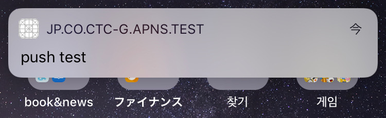
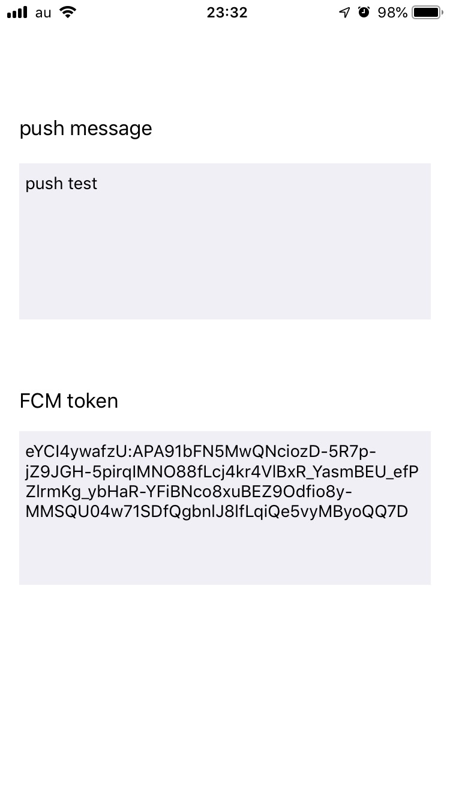

# Firebase이용해서 APNs Push

### [プッシュ通知に必要な証明書の作り方2018](https://qiita.com/natsumo/items/d5cc1d0be427ca3af1cb)

### [iOSライブラリ管理ツール「CocoaPods」の使用方法](https://qiita.com/satoken0417/items/479bcdf91cff2634ffb1)

### [FirebaseのPush通知をiOSで使ってみる](https://qiita.com/jiiikki/items/31f294cf2afcfe8d868d)


```swift
//
//  AppDelegate.swift
//  IIJApigeePushApp
//
//  Created by DC on 2019/03/12.
//  Copyright © 2019 DC. All rights reserved.
//

import UserNotifications
import Firebase
import FirebaseMessaging
import FirebaseInstanceID
import Alamofire

@UIApplicationMain
class AppDelegate: UIResponder, UIApplicationDelegate {
    
    var window: UIWindow?
    var viewController: ViewController!
    
    func application(_ application: UIApplication, didFinishLaunchingWithOptions launchOptions: [UIApplication.LaunchOptionsKey: Any]?) -> Bool {
        // Override point for customization after application launch.
        
        FirebaseApp.configure()
        
        // プッシュ通知登録
        addpush(application: application)
        
        return true
    }
    
    func addpush(application: UIApplication) {
        // プッシュ通知登録
        if #available(iOS 10.0, *) {
            UNUserNotificationCenter.current().delegate = self as? UNUserNotificationCenterDelegate
            UNUserNotificationCenter.current().requestAuthorization(options: [.alert,.sound,.badge], completionHandler: {(granted,error) in
                if granted{
                    DispatchQueue.main.async {
                        application.registerForRemoteNotifications()
                    }
                }
            })
            Messaging.messaging().subscribe(toTopic: "ios") { error in
                print("Subscribed to ios topic")
            }
        } else {
            let apnsTypes : UIUserNotificationType = [.badge, .sound, .alert]
            let notiSettings = UIUserNotificationSettings(types: apnsTypes, categories: nil)
            application.registerUserNotificationSettings(notiSettings)
            application.registerForRemoteNotifications()
        }
    }
    // プッシュ通知登録成功時のデバイストークン取得処理
    func application(_ application: UIApplication, didRegisterForRemoteNotificationsWithDeviceToken deviceToken: Data) {
        let tokenText = deviceToken.map { String(format: "%.2hhx", $0) }.joined()
        print("deviceToken = \(tokenText)")
        var token = ""
        for i in 0..<deviceToken.count {
            token = token + String(format: "%02.2hhx", arguments: [deviceToken[i]])
        }
        print(token)
        Messaging.messaging().apnsToken = deviceToken
        
        if let fcmtoken = Messaging.messaging().fcmToken {
            print("FCM token = \(fcmtoken)")
            viewController.tokenmessage.text = fcmtoken
        }
    }
    
    // プッシュ通知登録失敗時
    func application(_ application: UIApplication, didFailToRegisterForRemoteNotificationsWithError error: Error) {
        print("Failed to get token, error: \(error)")
    }
    // 通知取得時処理
    func application(_ application: UIApplication, didReceiveRemoteNotification userInfo: [AnyHashable : Any], fetchCompletionHandler completionHandler: @escaping (UIBackgroundFetchResult) -> Void) {
        print(userInfo)
        
        let notification = NSNotification(
            name:NSNotification.Name(rawValue: "my_push"),
            object: nil,
            userInfo:userInfo
        )
        
        NotificationCenter.default.post(notification as Notification)
    }
}

```



```swift
//
//  ViewController.swift
//  IIJApigeePushApp
//
//  Created by DC on 2019/03/12.
//  Copyright © 2019 DC. All rights reserved.
//

import UIKit

class ViewController: UIViewController {
    @IBOutlet var pushmessage: UITextView!
    @IBOutlet var tokenmessage: UITextView!
    
    let appDelegate:AppDelegate = UIApplication.shared.delegate as! AppDelegate
    
    override func viewDidLoad() {
        super.viewDidLoad()
        
        NotificationCenter.default.addObserver(self,selector: #selector(handlePushNotification(notification:)), name:NSNotification.Name(rawValue: "my_push"),object:nil)
        
        appDelegate.viewController = self
    }
    
    override func didReceiveMemoryWarning() {
        super.didReceiveMemoryWarning()
        // Dispose of any resources that can be recreated.
    }
    
    override func viewDidDisappear(_ animated: Bool) {
        NotificationCenter.default.removeObserver(self)
    }
    
    @objc func handlePushNotification(notification: NSNotification) {
        if let aps = notification.userInfo?["aps"] as? NSDictionary {
            if (aps["alert"] as? NSDictionary) != nil {
                let alert = aps["alert"] as! NSDictionary;
                pushmessage.text = alert["body"] as? String
            } else if (aps["alert"] as? NSString) != nil {
                pushmessage.text = aps["alert"] as? String
            }
        }
    }
}

```






