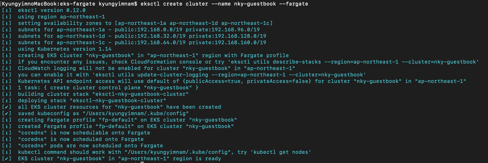
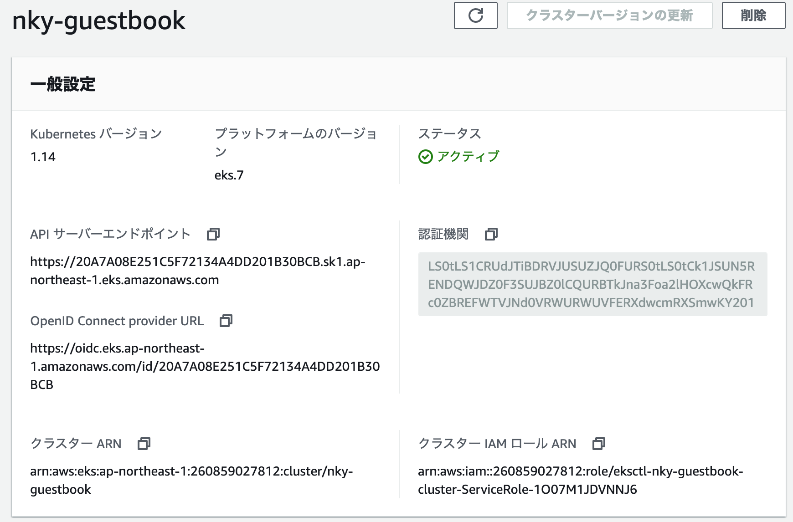
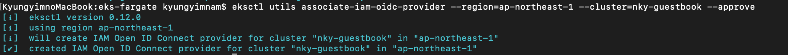
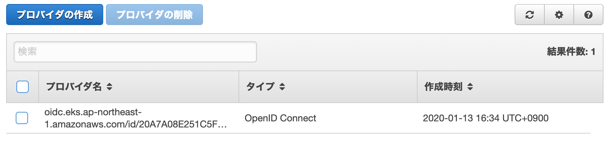
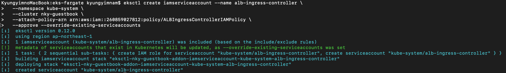
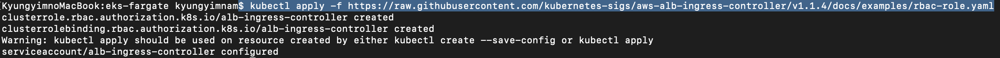
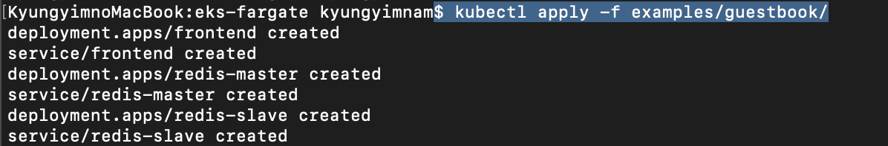

# aws eks



```bash
$ eksctl version
[ℹ]  version.Info{BuiltAt:"", GitCommit:"", GitTag:"0.12.0"}
$ aws --version
aws-cli/1.17.0 Python/3.7.4 Darwin/19.2.0 botocore/1.14.0
$ kubectl version --client --short
Client Version: v1.17.0
```

```
$ eksctl create cluster --name nky-guestbook --fargate
```

command result



aws eks cluster



```bash
$ eksctl utils associate-iam-oidc-provider --region=ap-northeast-1 --cluster=nky-guestbook --approve
```





```bash
$ eksctl create iamserviceaccount --name alb-ingress-controller \
  --namespace kube-system \
  --cluster nky-guestbook \
  --attach-policy-arn arn:aws:iam::260859027812:policy/ALBIngressControllerIAMPolicy \
  --approve --override-existing-serviceaccounts
```




```bash
$ kubectl get sa -n kube-system alb-ingress-controller -o jsonpath="{.metadata.annotations['eks\.amazonaws\.com/role-arn']}"
arn:aws:iam::260859027812:role/eksctl-nky-guestbook-addon-iamserviceaccount-Role1-M1786EM0W8UP
```

```bash
$ kubectl apply -f https://raw.githubusercontent.com/kubernetes-sigs/aws-alb-ingress-controller/v1.1.4/docs/examples/rbac-role.yaml
```




```bash
---
apiVersion: apps/v1
kind: Deployment
metadata:
  labels:
    app.kubernetes.io/name: alb-ingress-controller
  name: alb-ingress-controller
  namespace: kube-system
spec:
  selector:
    matchLabels:
      app.kubernetes.io/name: alb-ingress-controller
  template:
    metadata:
      labels:
        app.kubernetes.io/name: alb-ingress-controller
    spec:
      serviceAccountName: alb-ingress-controller
      containers:
        - name: alb-ingress-controller
          image: docker.io/amazon/aws-alb-ingress-controller:v1.1.4
          args:
            - --ingress-class=alb
            - --cluster-name=nky-guestbook # クラスタ名
            - --aws-region=ap-northeast-1
            - --aws-vpc-id=vpc-018a3914f392602b6 # eksctlで作成されたVPCのid
          resources: {}
```


```bash
$ kubectl apply -f alb-ingress-controller.yaml
deployment.apps/alb-ingress-controller created
```

```bash
$ git clone git@github.com:kubernetes/examples.git
```

Serviceのタイプを`ClusterIP`にします。


```bash
apiVersion: v1
kind: Service
metadata:
  name: frontend
  labels:
    app: guestbook
    tier: frontend
spec:
  # comment or delete the following line if you want to use a LoadBalancer
  # type: NodePort
  # if your cluster supports it, uncomment the following to automatically create
  # an external load-balanced IP for the frontend service.
  # type: LoadBalancer
  type: ClusterIP
  ports:
  - port: 80
  selector:
    app: guestbook
    tier: frontend
```


```bash
$ kubectl apply -f examples/guestbook/
```




```bash
---
apiVersion: networking.k8s.io/v1beta1
kind: Ingress
metadata:
  name: nginx
  annotations:
    kubernetes.io/ingress.class: alb
    alb.ingress.kubernetes.io/scheme: internet-facing
    alb.ingress.kubernetes.io/target-type: ip
spec:
  rules:
    - http:
        paths:
          - path: /*
            backend:
              serviceName: frontend
              servicePort: 80
```


デプロイ！

```bash
$ kubectl apply -f nginx.yaml
ingress.networking.k8s.io/nginx created
```

**eks cluster delete**

```bash
$ eksctl delete cluster --name nky-guestbook
```

参考サイト

[https://839.hateblo.jp/entry/2019/12/08/172020](https://839.hateblo.jp/entry/2019/12/08/172020)

