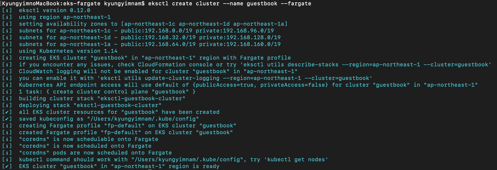
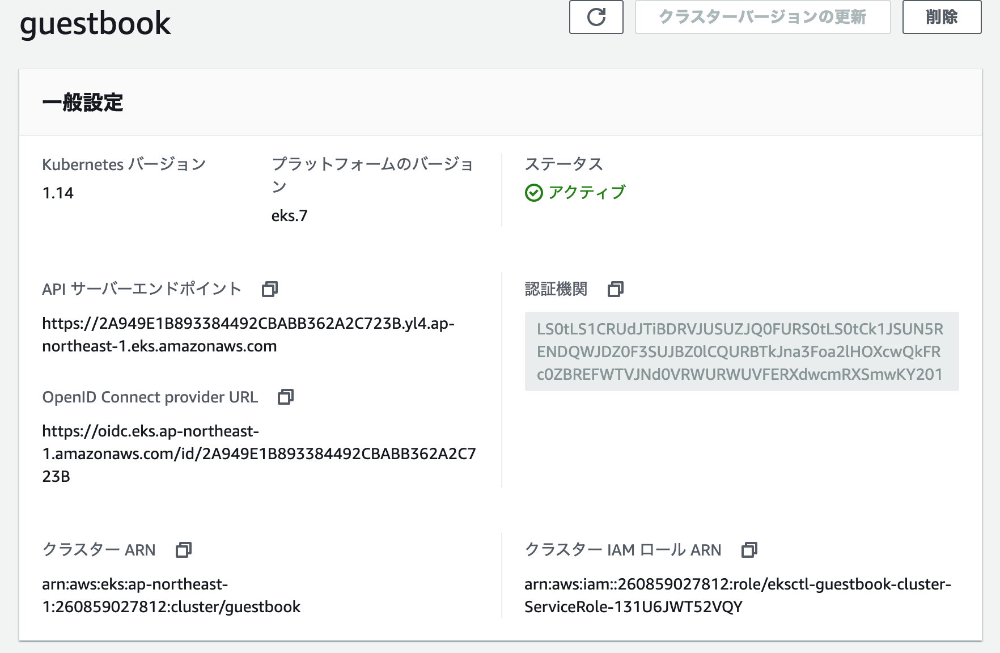

# aws eks



```bash
$ eksctl version
[ℹ]  version.Info{BuiltAt:"", GitCommit:"", GitTag:"0.12.0"}
$ aws --version
aws-cli/1.17.0 Python/3.7.4 Darwin/19.2.0 botocore/1.14.0
$ kubectl version --client --short
Client Version: v1.17.0
```

```
$ eksctl create cluster --name guestbook --fargate
```

command result



aws eks cluster



```bash
$ eksctl utils associate-iam-oidc-provider --region=ap-northeast-1 --cluster=guestbook --approve
```


参考サイト

[https://839.hateblo.jp/entry/2019/12/08/172020](https://839.hateblo.jp/entry/2019/12/08/172020)

