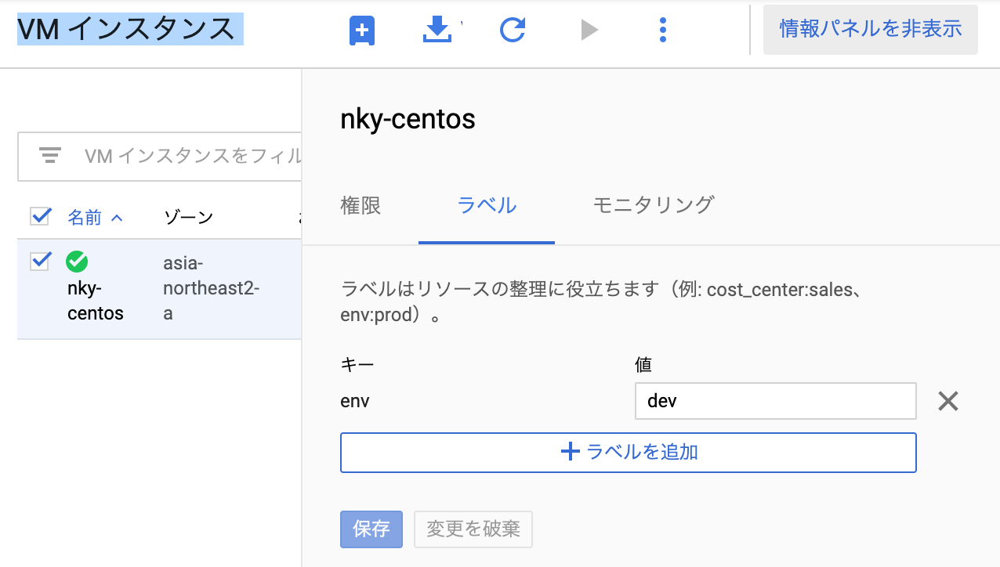
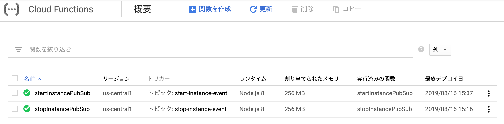
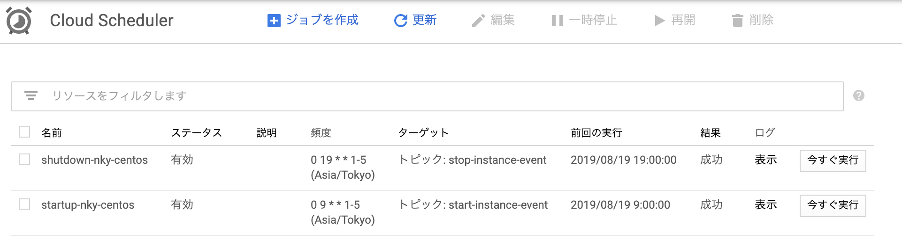

# GCPでジョブスケジューリング

## 1. Google Cloud SDK をインストール


[Google Cloud SDK をインストール](https://cloud.google.com/sdk/docs/quickstart-redhat-centos?hl=ja)


> #### VM インスタンスにラベル登録



### 2. Cloud Scheduler を使用した Compute インスタンスのスケジュール設定


[Cloud Scheduler を使用した Compute インスタンスのスケジュール設定](https://cloud.google.com/scheduler/docs/start-and-stop-compute-engine-instances-on-a-schedule?hl=ja)





```javascript
const {Buffer} = require('safe-buffer');
const Compute = require('@google-cloud/compute');
const compute = new Compute();

/**
 * Starts a Compute Engine instance.
 *
 * Expects a PubSub message with JSON-formatted event data containing the
 * following attributes:
 *  zone - the GCP zone the instances are located in.
 *  label - the label of instances to start.
 *
 * @param {!object} event Cloud Function PubSub message event.
 * @param {!object} callback Cloud Function PubSub callback indicating
 *  completion.
 */
exports.startInstancePubSub = (event, context, callback) => {
  try {
    const payload = _validatePayload(
      JSON.parse(Buffer.from(event.data, 'base64').toString())
    );
    const options = {filter: `labels.${payload.label}`};
    compute.getVMs(options).then(vms => {
      vms[0].forEach(instance => {
        if (payload.zone === instance.zone.id) {
          compute
            .zone(payload.zone)
            .vm(instance.name)
            .start()
            .then(data => {
              // Operation pending.
              const operation = data[0];
              return operation.promise();
            })
            .then(() => {
              // Operation complete. Instance successfully started.
              const message = 'Successfully started instance ' + instance.name;
              console.log(message);
              callback(null, message);
            })
            .catch(err => {
              console.log(err);
              callback(err);
            });
        }
      });
    });
  } catch (err) {
    console.log(err);
    callback(err);
  }
};

/**
 * Validates that a request payload contains the expected fields.
 *
 * @param {!object} payload the request payload to validate.
 * @return {!object} the payload object.
 */
function _validatePayload(payload) {
  if (!payload.zone) {
    throw new Error(`Attribute 'zone' missing from payload`);
  } else if (!payload.label) {
    throw new Error(`Attribute 'label' missing from payload`);
  }
  return payload;
}
```



```javascript
const {Buffer} = require('safe-buffer');
const Compute = require('@google-cloud/compute');
const compute = new Compute();

/**
 * Stops a Compute Engine instance.
 *
 * Expects a PubSub message with JSON-formatted event data containing the
 * following attributes:
 *  zone - the GCP zone the instances are located in.
 *  instance - the name of a single instance.
 *  label - the label of instances to start.
 *
 * Exactly one of instance or label must be specified.
 *
 * @param {!object} event Cloud Function PubSub message event.
 * @param {!object} callback Cloud Function PubSub callback indicating completion.
 */
exports.stopInstancePubSub = (event, context, callback) => {
  try {
    const payload = _validatePayload(
      JSON.parse(Buffer.from(event.data, 'base64').toString())
    );
    const options = {filter: `labels.${payload.label}`};
    compute.getVMs(options).then(vms => {
      vms[0].forEach(instance => {
        if (payload.zone === instance.zone.id) {
          compute
            .zone(payload.zone)
            .vm(instance.name)
            .stop()
            .then(data => {
              // Operation pending.
              const operation = data[0];
              return operation.promise();
            })
            .then(() => {
              // Operation complete. Instance successfully stopped.
              const message = 'Successfully stopped instance ' + instance.name;
              console.log(message);
              callback(null, message);
            })
            .catch(err => {
              console.log(err);
              callback(err);
            });
        }
      });
    });
  } catch (err) {
    console.log(err);
    callback(err);
  }
};

/**
 * Validates that a request payload contains the expected fields.
 *
 * @param {!object} payload the request payload to validate.
 * @return {!object} the payload object.
 */
function _validatePayload(payload) {
  if (!payload.zone) {
    throw new Error(`Attribute 'zone' missing from payload`);
  } else if (!payload.label) {
    throw new Error(`Attribute 'label' missing from payload`);
  }
  return payload;
}
```



```javascript
{
  "name": "cloud-functions-schedule-instance",
  "version": "0.1.0",
  "private": true,
  "license": "Apache-2.0",
  "author": "Google Inc.",
  "repository": {
    "type": "git",
    "url": "https://github.com/GoogleCloudPlatform/nodejs-docs-samples.git"
  },
  "engines": {
    "node": ">=8.0.0"
  },
  "scripts": {
    "test": "mocha test/*.test.js --timeout=20000"
  },
  "devDependencies": {
    "@google-cloud/nodejs-repo-tools": "^3.3.0",
    "mocha": "^6.0.0",
    "proxyquire": "^2.0.0",
    "sinon": "^7.0.0"
  },
  "dependencies": {
    "@google-cloud/compute": "^1.0.0",
    "safe-buffer": "^5.1.2"
  }
}
```




